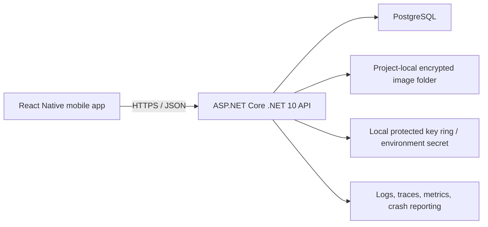
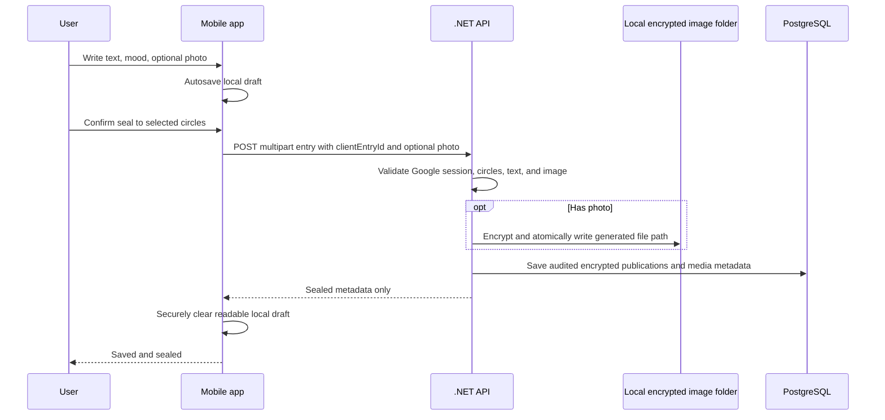

# Bloom implementation plan

Status: implementation handoff  
Frontend: React Native with TypeScript  
Backend: ASP.NET Core on .NET 10  
Source of truth for the initial UI: `bloom-mockup-full.html`

## Implementation checkpoint — 2026-08-23

The first vertical slice is now scaffolded in the repository:

- `apps/mobile`: Expo SDK 54 + TypeScript + Expo Router native tabs, Google ID-token sign-in, SecureStore session persistence, design tokens, and the initial Home/Write/Circles/Profile shell.
- `backend/Bloom.slnx`: .NET 10 projects for API, Application, Domain, Infrastructure, Contracts, and tests.
- `Bloom.Api`: Google bearer-token validation boundary, Bloom access/refresh sessions, authenticated `/api/v1/me`, `/health`, local Data Protection key directory, and development-safe console logging.
- `Bloom.Domain`/`Bloom.Application`: Google user aggregate, common audit fields, and audit stamping services.
- `Bloom.Infrastructure`: an explicitly temporary in-memory user adapter so the first slice runs without a mismatched database provider.
- `Bloom.UnitTests`: five passing audit/identity tests.

The next required backend slice is the persistence adapter and migrations. The current auth/user/session state is process-local and will be lost on restart; do not treat it as production-ready. The local project image folder and PostgreSQL adapter should be added only after choosing a stable provider compatible with the installed .NET/EF version.

## 1. Product summary

Bloom is a private, delayed-sharing diary for small groups. A user creates a **circle**, invites friends, chooses an immutable **bloom date**, and writes entries into that circle while it is sealed. When the server reaches the bloom time, eligible members can read the entries together in a shared timeline and add reactions or comments.

The product promise is:

> Write honestly now. Read together later.

The app should feel calm and forgiving. Streaks are encouragement, not competition. Missing a day never prevents a circle from blooming.

## 2. Product rules to settle before coding

These rules remove ambiguity from the mockup and should be treated as acceptance criteria.

### 2.1 Circle lifecycle

- A circle has `Draft`, `Sealed`, `Bloomed`, or `Archived` status.
- The creator chooses a name, emoji, duration/custom date, and IANA time zone.
- The API converts the chosen local bloom time to a fixed UTC instant (`BloomAtUtc`).
- The bloom instant becomes immutable when the circle is planted/activated.
- Circle state is derived from `BloomAtUtc <= serverNowUtc`; it must not depend only on a scheduled job running successfully.
- The minimum recommended duration is one month. The supported presets are 1 month, 3 months, 6 months, and 1 year, plus a custom date.
- Invitations may be accepted after the circle starts, but never after it blooms.
- A late joiner can only see entries created on or after their `JoinedAtUtc`, matching the mockup copy.
- When a member leaves before bloom, they immediately lose access. Their entries in that circle become permanently private and are never exposed to the remaining members. Keep the rows for account export/retention purposes, but mark their publications `Withdrawn`.
- A circle with only one remaining member may still bloom for that member, unless the product team later chooses automatic cancellation.

### 2.2 Entry lifecycle

- A user can submit at most one entry per circle per **author-local calendar day** in the MVP.
- The write screen can submit the same content to multiple circles in one request. The server creates one sealed publication per selected circle.
- The local draft remains readable and editable on the device until submission.
- After the server confirms submission, that publication is sealed: there is no read, edit, or normal delete endpoint before bloom.
- A failed or offline submission stays as a local draft and is not described as sealed until the server acknowledges it.
- Each entry has text, an optional mood, an optional prompt reference, and up to one image in the MVP.
- Empty text is allowed only if an image exists.
- Backdating is not supported in the MVP. The API accepts the user's current local date and validates it against server time with a reasonable time-zone/skew allowance.
- Use an idempotency key/client entry ID so retries cannot create duplicates.
- After bloom, entries remain immutable; reactions and comments are separate mutable records.

### 2.3 Sealed privacy promise

“Even you cannot reread it” is an authorization and data-protection rule, not just a UI state.

- All entry reads go through the API; pre-bloom read attempts return `423 Locked` without entry text or media URLs.
- The mobile cache must never persist submitted entry bodies or photo files after successful sealing.
- Entry text and media are encrypted at rest. For the current single-instance stage, keep the encryption secret outside source control and encrypt through `IEntryProtector`/`IImageProtector` interfaces. A later deployment can replace these implementations with cloud KMS-backed storage without changing domain code.
- The write path may encrypt but does not need to decrypt. The read path checks circle state, membership window, and withdrawal status before decrypting.
- Never include entry text, comment text, media paths, auth tokens, Google tokens, or encryption material in logs, traces, analytics, or crash reports.
- Product copy must not claim end-to-end encryption unless a separate audited client-held-key design is implemented. With the proposed MVP, authorized backend infrastructure can technically decrypt data.
- Account erasure and legal retention are exceptional administrative paths and must be audited; they are not ordinary entry-read paths.

### 2.4 Social behavior after bloom

- Only eligible, non-departed circle members can read the bloomed timeline.
- The timeline groups entries by the author's local diary date, then orders entries consistently by submission time.
- Reactions are limited to an allowlist of emoji and one reaction of each type per user per entry.
- Comments are available only after bloom. Authors can delete their own comments; a circle creator may hide abusive comments, with an audit record.
- The current stage has no push notifications or background notification processing.

## 3. Scope

### 3.1 MVP (release 1)

- Three-screen onboarding.
- Google Sign-In only. There is no local registration, password, or password-recovery flow.
- Backend validation of Google identity followed by a Bloom application session, sign-out, and session renewal.
- Profile, user name/avatar, time zone, privacy, and appearance preferences.
- Home dashboard with today's writing call-to-action, upcoming circles, newly bloomed circles, and basic stats.
- Create a circle with preset/custom bloom date.
- Invite an existing Bloom user found through in-app user search. Invite links are not included.
- Accept/decline an invitation and view members.
- Leave a circle with an explicit explanation of the privacy result.
- Compose a local draft, pick a mood/prompt, attach one photo, and seal it into one or more circles.
- Circle progress ring and personal contribution heatmap without exposing content.
- Bloomed timeline and entry detail.
- Reactions and comments.
- Foreground refresh and app-resume refresh so newly bloomed circles and pending invitations appear without background workers.
- Basic profile statistics and account deletion.
- Accessibility, loading/empty/error/offline states, analytics, monitoring, and production deployment.

### 3.2 Release 1.1 / post-MVP

- Multiple photos, short audio diary entries, and richer prompt packs.
- Report/block/moderation workflow if public user search is enabled.
- Saved filters/search inside bloomed timelines.
- Localization and right-to-left layout.
- Optional on-device reminders and widgets; these must not require a server worker.

### 3.3 Later experiments

- A “first reactions” bloom event or synchronized reveal animation.
- Optional circle themes and seasonal growth visuals.
- Collaborative prompt packs chosen before sealing.
- Personal “garden” showing past circles without exposing their content on the home screen.

Do not include public feeds, follower counts, leaderboards, or competitive streak rankings; they work against the intimate diary concept.

### 3.4 Explicitly excluded from the current plan

- Manual registration, passwords, password reset, or any non-Google login provider.
- Cloud/object image storage; use the configured project-local folder only.
- Background workers, scheduled jobs, server-driven reminders, push notifications, and the mockup's notification screen/bell.
- Keepsakes, PDF/printed book generation, public/private share links, and the mockup's Keepsake action/screen.
- AI summaries or any other AI processing of diary content.
- The mockup's reminder setting and data-export job. These controls should be hidden rather than left non-functional.

## 4. Recommended architecture

Start as a **modular monolith**, not microservices. It is cheaper to build, test, deploy, and operate, while module boundaries allow later extraction if scale demands it.



Recommended deployment units:

1. `Bloom.Api`: the HTTP API and current project-local image host. It is stateful/single-instance at this stage because images live on its persistent local volume.
2. PostgreSQL.
3. A persistent local volume for encrypted image files and encryption key material.

The current stage deliberately has no Redis, background worker, push provider, cloud object storage, keepsake processor, or scheduled bloom job. This means the API should be deployed as a single instance unless the image folder is moved to shared storage. In a container or hosted environment, `App_Data` must be mounted on a persistent volume or images will disappear on redeploy. Database and image-folder backups must be coordinated.

### 4.1 Repository layout

```text
Bloom/
  apps/
    mobile/
      src/
        api/
        components/
        features/
          auth/
          home/
          entries/
          circles/
          bloom/
          profile/
        navigation/
        storage/
        theme/
        utils/
      assets/
      app.config.ts
      package.json
  backend/
    Bloom.slnx
    src/
      Bloom.Api/
        App_Data/
          uploads/               # ignored runtime image files
      Bloom.Application/
      Bloom.Domain/
      Bloom.Infrastructure/
      Bloom.Contracts/
    tests/
      Bloom.UnitTests/
      Bloom.IntegrationTests/
      Bloom.ArchitectureTests/
  docs/
    BLOOM_IMPLEMENTATION_PLAN.md
    api/
    decisions/
  .github/workflows/
```

Keep modules inside the backend projects for `Identity`, `Circles`, `Entries`, `BloomTimeline`, `Social`, and `Media`. Prefer feature/vertical-slice handlers within the application layer over large generic service classes.

## 5. React Native frontend plan

### 5.1 Foundation

- Use React Native with TypeScript. Expo is recommended for the MVP because Google OAuth, camera/library access, secure storage, and builds are faster to integrate. Use the current stable Expo SDK compatible with the chosen React Native version at implementation time.
- Use Expo Router or React Navigation's native stack plus native tabs. The root has onboarding/Google sign-in routes and a signed-in tab navigator: Home, Write, Circles, Profile.
- Use TanStack Query for server state, caching, retries, and pagination.
- Use a small client-state store such as Zustand only for ephemeral UI state and draft coordination; do not duplicate server entities globally.
- Use React Hook Form plus Zod for forms and client-side validation.
- Generate the TypeScript API client and DTO types from the backend OpenAPI document. Do not maintain handwritten duplicate contracts.
- Start Google OAuth with Authorization Code + PKCE through the supported Expo/native integration. Validate identity on the backend; never treat a client-decoded Google token as authenticated. Store only the resulting Bloom session tokens in platform secure storage.
- Keep Bloom access tokens short-lived and rotate hashed refresh/session tokens. Google remains the sole login provider; these Bloom tokens are session plumbing, not another login method.
- Persist only safe query data. Explicitly exclude sealed entry bodies, media URLs, and secrets from persistent caches.
- Use `expo-image` for avatars and diary images, including cache/recycling keys in virtualized timelines.
- Use the platform time-zone API and send IANA time-zone identifiers.
- Add error boundaries and a consistent result/error component model.

### 5.2 Navigation and screens mapped from the mockup

| Area | Screens | Important production additions |
|---|---|---|
| Onboarding/auth | Concept slides, Continue with Google | Terms/privacy consent, cancelled OAuth, invalid/expired Google response, session errors |
| Home | Empty home and populated dashboard | Skeletons, pull-to-refresh, offline banner, app-resume refresh |
| Write | Circle selector, prompt, mood, editor, photo picker | Local autosave, upload progress, retry, sealing confirmation |
| Circles | All/sealed/bloomed list, new circle | Pending invitations and draft circles |
| Sealed circle | Growth ring, bloom date, heatmap, member link | Server-time status, contribution counts only |
| Members/invites | Member list, user search, selection | Invite state, accept/decline, destructive leave confirmation |
| Bloom | Date-grouped virtualized timeline, entry detail | Cursor pagination, image loading, retry/error states |
| Social | Reactions, comments | Optimistic updates with rollback and abuse controls |
| Profile/settings | Stats, privacy, appearance | Profile editing, deletion, and legal pages |

### 5.3 Component and design system

Extract the mockup into reusable primitives before implementing screens:

- `Screen`, `TopBar`, `BottomTabs`, `SectionLabel`.
- `PrimaryButton`, `SecondaryButton`, `DangerButton`, `IconButton`.
- `TextField`, `DiaryEditor`, `Chip`, `MoodPicker`, `Toggle`.
- `CircleCard`, `GrowthRing`, `MemberAvatarStack`, `ContributionHeatmap`.
- `EntryCard`, `CommentRow`, `ReactionPill`.
- `EmptyState`, `Skeleton`, `ErrorState`, `OfflineBanner`, `Toast`.
- `ConfirmSheet` for sealing, leaving, comment deletion, and account deletion.

Initial design tokens from the mockup:

```ts
export const colors = {
  background: '#FFF9F3',
  ink: '#33262E',
  inkSoft: '#7A6B72',
  coral: '#FF6F81',
  coralDark: '#E8536A',
  sage: '#6FA97C',
  sageDark: '#39533F',
  sageLight: '#DEEBE0',
  butter: '#FFC857',
  lavender: '#A996CF',
  lavenderLight: '#ECE6F7',
  cardWarm: '#FFEADC',
  card: '#FFFFFF',
  line: '#F0DFCE',
};
```

Use Plus Jakarta Sans for UI and Fraunces for display text, subject to font licensing/bundling verification. Replace emoji used as functional icons with a consistent accessible icon set; emoji may remain as decorative circle identity and mood choices.

### 5.4 Draft and submission flow

1. Load eligible sealed circles and today's prompt.
2. Restore a local device draft keyed by user and local date.
3. Autosave text/mood/selected circles/local image reference locally with a short debounce.
4. On submit, show a clear confirmation: the selected circle names and that the user cannot reread the submitted content until each blooms.
5. Submit the entry as `multipart/form-data` with the optional image and a stable `clientEntryId`; the API writes the image through its local-storage abstraction.
6. The API validates all selected circles, stores the encrypted local image when present, and creates a publication for each. The operation is all-or-nothing for the MVP, including cleanup of a newly written file if the database transaction fails.
7. On success, erase the local body and photo immediately, invalidate home/circle statistics, and show the sealed success state.
8. On failure, retain the draft and show a retry path.

### 5.5 Mobile accessibility and quality

- Meet WCAG 2.2 AA contrast where applicable; the lighter palette must be measured rather than assumed accessible.
- Support dynamic text sizes without clipped cards or fixed-height screens.
- Give every icon-only control an accessibility label, role, state, and adequate hit target.
- Respect reduced motion and avoid making the bloom animation necessary to understand state.
- Add keyboard avoidance and screen-reader announcements for validation, save progress, and success.
- Use FlashList or LegendList for every list screen, particularly bloom timelines, circles, member search, comments, and profile rows. Memoize list rows and stabilize callbacks.
- Test small Android devices, current iPhones, landscape where allowed, dark appearance if shipped, slow network, denied photo permission, and interrupted uploads.

## 6. .NET 10 backend plan

### 6.1 Foundation

- ASP.NET Core Web API targeting .NET 10.
- Entity Framework Core 10 with PostgreSQL.
- Google OpenID Connect is the only identity provider. The API validates Google's issuer, audience, signature, expiry, nonce, and verified-email claims, then creates or finds the local `User` by Google's immutable `sub` claim.
- After Google validation, issue short-lived Bloom JWT access tokens and rotating, hashed Bloom refresh/session tokens. Do not store Google access or refresh tokens because Bloom does not need to call Google APIs after sign-in.
- OpenAPI generated by the API and used to generate the mobile client.
- Problem Details (`application/problem+json`) for all non-success responses, with stable machine-readable error codes.
- FluentValidation or endpoint-level validators for request rules.
- Built-in rate limiting, request size limits, health endpoints, structured logging, OpenTelemetry tracing/metrics, and correlation IDs.
- UTC for persisted instants, `DateOnly` for author-local diary dates, and IANA time-zone IDs for user/circle intent.
- Optimistic concurrency tokens on mutable aggregate roots.
- Strongly typed, startup-validated options for Google OAuth, local image paths/limits, token signing, encryption, and allowed origins. Secrets come from environment variables or development user-secrets, never committed settings.
- Use constructor dependency injection, async APIs for every I/O path, focused interfaces such as `IImageStorage`, and primary-constructor syntax where it stays readable. Add XML documentation to public contracts/interfaces and use resource-backed user-facing error messages.
- Use MSTest with FluentAssertions for backend tests and Moq only where a real/fake implementation is less appropriate. Follow Arrange/Act/Assert and cover both success and failure paths.

### 6.2 Domain model

Use UUID/ULID identifiers consistently. **Every domain entity and join entity** implements `IAuditableEntity` with `CreatedAtUtc`, `CreatedByUserId`, `LastModifiedAtUtc`, and `LastModifiedByUserId`. The user IDs may be null only for the initial externally authenticated user or a documented system operation. Entities that support soft deletion additionally have `DeletedAtUtc` and `DeletedByUserId`.

Populate audit fields centrally with an EF Core `SaveChangesInterceptor` using the authenticated user context and `TimeProvider`; clients must never submit or overwrite them. Add tests for create, update, soft delete, unauthenticated system actions, and attempts to bind audit fields from requests. Keep `AuditEvent` for important security/business events; row audit fields and the audit-event trail solve different problems.

The core tables/entities below inherit those audit fields even when they are not repeated in each field list:

#### Identity and relationships

- `User`: `Id`, `GoogleSubject`, `Email`, `EmailVerified`, `DisplayName`, `GoogleAvatarUrl`, `TimeZoneId`, `Locale`. Unique index on `GoogleSubject`; keep a separate internal ID so Google remains an external identity concern.
- `UserSession`: `Id`, `UserId`, `RefreshTokenHash`, device metadata, expiry, rotation/revocation/reuse-detection data.
- `Friendship` (optional for the first slice): requester, addressee, status. A friendship is not required to invite an existing Bloom user.
- `UserPreference`: appearance and privacy preferences. Push/reminder fields are deferred.

#### Circles

- `Circle`: `Id`, `Name`, `Emoji`, `CreatorUserId`, `Status`, `StartedAtUtc`, `BloomAtUtc`, `TimeZoneId`, `ArchivedAtUtc`, concurrency token.
- `CircleMembership`: `CircleId`, `UserId`, `Role`, `Status`, `InvitedAtUtc`, `JoinedAtUtc`, `LeftAtUtc`. Unique index on `(CircleId, UserId)`.
- `CircleInvitation`: `Id`, `CircleId`, `InviterUserId`, `InviteeUserId`, status, responded timestamp. No link token is needed in the current stage.

#### Entries and media

- `DiaryEntry`: `Id`, `AuthorUserId`, `ClientEntryId`, `AuthorLocalDate`, `AuthorTimeZoneId`, `Mood`, `PromptId`. Unique `(AuthorUserId, ClientEntryId)`.
- `EntryPublication`: `Id`, `DiaryEntryId`, `CircleId`, encrypted body payload/version, status (`Sealed`, `Withdrawn`, `Available` as a projection), created timestamp. Unique `(DiaryEntryId, CircleId)` and `(CircleId, AuthorUserId, AuthorLocalDate)` through a denormalized author/date constraint or transaction-safe validation.
- `MediaAsset`: owner, purpose, generated relative storage key, content type, size, checksum, encryption metadata, upload state. Never store a client-supplied path or original file name as the storage key.
- `EntryMedia`: publication, media asset, order. In the MVP, enforce one asset per publication.
- `Prompt`: localized text, category, active dates/weight, enabled flag.

#### Bloomed interactions

- `Reaction`: entry publication, user, emoji code, timestamp. Unique `(EntryPublicationId, UserId, EmojiCode)`.
- `Comment`: entry publication, author, body, created/edited/deleted timestamps, moderation status.
- `AuditEvent`: security/administrative action, actor, target type/ID, safe metadata. It also inherits the common row audit fields.

Important indexes:

- Circles by member and `BloomAtUtc`.
- Memberships by user/status and circle/status.
- Publications by circle/date/created time and diary entry.
- Comments and reactions by publication/created time.

Every query must be scoped by the authenticated user through an explicit authorization policy; avoid a generic repository that makes unscoped entity access easy.

### 6.3 API outline

Use `/api/v1`. Exact request/response schemas belong in OpenAPI and contract tests.

#### Authentication and profile

```text
POST   /auth/google
POST   /auth/refresh
POST   /auth/logout
GET    /me
PATCH  /me
GET    /me/stats
GET    /me/preferences
PUT    /me/preferences
DELETE /me
```

The mobile app starts Google's native Authorization Code + PKCE flow with a nonce. `POST /auth/google` accepts the resulting Google ID token, the original nonce, and platform identifier. The API validates the signature, issuer, expiry, nonce, verified-email claim, and audience against the configured iOS/Android client IDs; uses the immutable Google `sub` as the external identity key; and returns Bloom session tokens. It creates the local user automatically on first sign-in and does not persist Google tokens. There are no register, password login, password reset, email-verification, or local-credential endpoints.

#### Users/friends/invitations

```text
GET    /users/search?q={query}
GET    /invitations
POST   /invitations/{invitationId}/accept
POST   /invitations/{invitationId}/decline
```

If a friend graph is included:

```text
GET    /friends
POST   /friend-requests
POST   /friend-requests/{id}/accept
DELETE /friends/{userId}
```

#### Circles

```text
GET    /circles?status=sealed|bloomed&cursor={cursor}
POST   /circles
GET    /circles/{circleId}
GET    /circles/{circleId}/members
POST   /circles/{circleId}/invitations
DELETE /circles/{circleId}/members/me
POST   /circles/{circleId}/archive
```

The circle detail response may include safe derived values: state, days elapsed/total, progress percentage, current member summaries, the current user's contribution dates, and whether they wrote today. It must not include sealed content or aggregate information that reveals another member's private writing frequency unless that behavior is explicitly approved.

#### Entries and media

```text
POST   /entries                                      (multipart/form-data)
GET    /circles/{circleId}/timeline?cursor={cursor}&date={date}
GET    /entries/{publicationId}
GET    /media/{mediaId}/content
```

`POST /entries` accepts a JSON part containing the client ID, author-local date/time zone, text, optional mood/prompt, and one or more circle IDs, plus one optional image part. The response contains publication IDs and safe sealed metadata, never a replay of the body.

Pre-bloom timeline/detail requests return `423 Locked` with code `circle_not_bloomed`. Non-members receive `404` to avoid revealing private circle existence.

#### Reactions and comments

```text
PUT    /entries/{publicationId}/reactions/{emoji}
DELETE /entries/{publicationId}/reactions/{emoji}
GET    /entries/{publicationId}/comments?cursor={cursor}
POST   /entries/{publicationId}/comments
DELETE /comments/{commentId}
```

### 6.4 Authorization policies

Implement and test named policies/requirements rather than scattering role checks:

- `CanViewCircleMetadata`.
- `CanManageCircleInvitations` (creator in MVP).
- `CanSubmitToCircle` (active member, circle sealed, date valid).
- `CanViewBloomedPublication` (server time past bloom, active eligible membership, entry at/after join, publication not withdrawn).
- `CanInteractWithPublication` (same as view plus not archived/read-only if that rule is added).
- `CanDeleteComment`.

Use a controllable `TimeProvider` throughout so bloom-boundary tests do not depend on wall-clock time.

### 6.5 No background worker at the current stage

- Do not create `Bloom.Worker`, an outbox processor, reminder scheduler, push pipeline, scheduled bloom transition, export job, or keepsake job.
- Bloom state is calculated from `BloomAtUtc` and the server's `TimeProvider` on every relevant query. Therefore a circle blooms correctly without a job.
- The mobile app refreshes the home/circle queries when it starts, resumes from the background, or the user pulls to refresh.
- Invitations, comments, reactions, and audit rows are written synchronously in the same request/transaction that performs the action.
- If async work becomes necessary later, add an outbox and worker as a separate phase rather than placing fire-and-forget tasks inside API requests.

### 6.6 Project-local image storage

1. Configure `ImageStorage:RootPath`, defaulting in development to `backend/src/Bloom.Api/App_Data/uploads`. Resolve and validate the absolute path at startup.
2. Add runtime files and local key material under `App_Data` to `.gitignore`; commit at most an empty placeholder. Never commit user images or encryption keys.
3. `POST /entries` receives one bounded image through multipart form data. Reject the request before allocation when the declared/request size exceeds the configured limit.
4. Validate the actual file signature, allowed content type, decoded dimensions, and checksum. Strip EXIF/location metadata and normalize the image synchronously before accepting the entry.
5. Generate the relative path on the server from opaque IDs, for example `{userId}/{year}/{month}/{mediaId}.bin`. Ignore the client file name, reject path separators, resolve the final full path, and verify it remains under the configured root.
6. Encrypt bytes before writing. Write to a temporary file in the same root and atomically rename it only when validation succeeds. If the database transaction fails, delete the newly written file in the request's compensation path.
7. Store only the generated relative path and safe metadata in PostgreSQL. The folder must not be under `wwwroot` and must not be exposed by static-file middleware.
8. `GET /media/{mediaId}/content` performs the same circle, bloom, membership, joined-date, and withdrawn-publication authorization as entry text before decrypting and streaming the file.
9. The current local implementation is single-instance only. Back up PostgreSQL and `App_Data/uploads` together, and mount `App_Data` as persistent storage when using containers.
10. Keep `IImageStorage` and `IImageProtector` interfaces so local file storage can later be replaced without changing entry handlers or domain models.

## 7. Key user flows

### 7.1 Create and join a circle

1. Creator enters circle identity, members, duration/custom date, and time zone.
2. Mobile previews the exact local date and fixed time.
3. API validates the date and creates the circle, creator membership, and invitations in one transaction.
4. Invitees see pending invitations when the app starts, resumes, or refreshes.
5. On acceptance, `JoinedAtUtc` establishes the earliest entry they may later see.

### 7.2 Seal an entry



### 7.3 Bloom and read

1. At every request, the API compares `BloomAtUtc` with `TimeProvider.GetUtcNow()`.
2. Once reached, eligible timeline queries succeed without waiting for a job.
3. Mobile refreshes on launch/resume or user action, changes the growth ring to bloom state, and paginates the shared timeline.
4. Content and local image bytes are decrypted only after authorization succeeds.
5. Reactions/comments become enabled.

## 8. Suggested features that strengthen the idea

Prioritize features that deepen delayed connection rather than turn Bloom into another social feed.

### High-value additions

- **Opening note:** before planting, each member writes a short hope for the future circle. It opens at bloom with the diary.
- **Prompt packs:** travel, family, university, long-distance friendship, grief/support, or “small joys.” A circle can choose a pack without seeing future prompts.
- **Gentle catch-up:** the home screen can show a private writing cue when a user has not written recently, without requiring push or scheduled processing.
- **Bloom ritual:** a polished, optional opening animation followed by “then vs. now” opening notes and the date-grouped timeline.
- **Private post-bloom search:** search only content the current member is authorized to read.
- **Personal reflection:** after bloom, let an author privately annotate their old entry with what happened next.
- **Circle memory map/calendar:** a post-bloom calendar view showing which dates contain entries, without competitive per-person counts.
- **Plant again:** after bloom, offer an in-app action to start a new circle with the same members.

### Features to approach carefully

- **Editing after submission:** undermines the time-capsule promise. Prefer no edits.
- **Creator moderation before bloom:** must never provide the creator a back door into sealed content.

## 9. Security, privacy, and abuse controls

- Threat-model unauthorized pre-bloom reads, IDOR, clock manipulation, membership races, path traversal, local-file disclosure, stolen Bloom session tokens, forged/replayed Google identity tokens, admin access, backups, and logs.
- Treat server time as authoritative. Never trust the device clock for bloom access.
- Validate authorization again before streaming every media file.
- Validate Google OIDC tokens against the configured issuer/audience/signing keys, nonce, expiry, and verified-email claim. Key users by Google `sub`, not by mutable email.
- Hash Bloom refresh/session tokens in the database, rotate them, detect reuse, and rate-limit Google auth, refresh, search, invite, and comment endpoints.
- Encrypt database backups, entry payloads, and local image files. Keep encryption secrets and the local key ring outside source control with access restricted to the API process.
- Strip photo EXIF metadata, validate actual file signatures, cap dimensions/size, and bound synchronous image-processing time/memory.
- Use parameterized EF queries, output encoding, strict DTO allowlists, and safe Markdown/plain text. Do not accept arbitrary HTML.
- Provide block/report tools before broad user discovery or public invite surfaces.
- Maintain privacy policy, terms, retention schedule, backup deletion behavior, and account deletion flows before store launch. Add data export later if required by the launch jurisdiction/product policy.
- Audit exceptional support/admin operations. Production staff should not have routine direct access to diary plaintext.
- Run dependency, secret, static analysis, container, and infrastructure scans in CI.

## 10. Testing strategy

### Backend

- Unit-test domain rules: bloom instant, duration, circle state, join/leave visibility, daily uniqueness, and reaction rules.
- Use `TimeProvider` fakes for one millisecond before/at/after bloom and daylight-saving transitions.
- Integration-test every endpoint with real PostgreSQL (containers in CI), especially authorization matrices.
- Assert that pre-bloom responses and logs contain no plaintext.
- Test idempotent entry retries, invitation acceptance races, simultaneous submissions, leave-vs-bloom races, audit-field population, and local-file compensation when a database write fails.
- Contract-test generated OpenAPI and mobile client compatibility.
- Test media authorization, path traversal attempts, invalid file signatures, oversized images, missing/corrupt local files, and that the upload directory cannot be served statically.

### Mobile

- Unit-test date formatting, progress, validators, reducers/stores, and safe cache configuration.
- Component-test all states: loading, empty, success, validation, locked, error, offline, and accessibility labels.
- Integration-test Google sign-in cancellation/failure, draft restore, interrupted photo upload, idempotent retry, multi-circle submission, successful local draft clearing, invitations, and Bloom token refresh.
- End-to-end test the critical path on iOS and Android: Google sign in → create circle → accept invite → write → simulate bloom in a test environment → read → react/comment → leave.
- Add screenshot/visual-regression tests for core screens and verify against the HTML mockup.

### Non-functional gates

- No plaintext diary content in client persistent cache after seal or in backend logs/traces.
- Timeline first page remains responsive with at least 1,000 entries in a circle.
- API endpoints use cursor pagination and bounded response sizes.
- Accessibility checks pass for core flows.
- Restore a production-like backup in a staging drill before launch.

## 11. Observability and analytics

Track product events without diary content:

- Onboarding completed.
- Circle created, invitation sent/accepted/declined, member left.
- Draft started, entry seal attempted/succeeded/failed, photo upload failed.
- Circle bloomed, timeline opened, reaction/comment created.

Operational signals:

- API latency/error rate by route template.
- Authentication and rate-limit failures.
- Upload verification failures and orphan count.
- Timeline authorization denials and anomalous locked-read attempts.
- Google token-validation failures, local image-folder availability/free space, decryption failures, and PostgreSQL health.

Use user/record pseudonymous IDs and never attach diary text, comments, email addresses, tokens, or local media paths to analytics.

## 12. Delivery phases

Each phase should end in a deployable, tested vertical slice.

### Phase 0 — decisions and scaffolding

- Confirm the product rules in section 2 and MVP boundary.
- Create the monorepo layout, mobile app, .NET solution, local container dependencies, CI, formatting/linting, OpenAPI generation, environment configuration, and architecture decision records.
- Extract the design tokens/components and implement a static navigation shell from the mockup.
- Establish staging/production environments, secrets, telemetry, and database migrations.

Exit: both apps build in CI; the mobile app reaches a health-checked API in local and staging environments.

### Phase 1 — Google identity and profile

- Continue with Google, backend OIDC validation, first-sign-in user provisioning, Bloom session refresh, and logout.
- Secure token handling, current-user endpoint, profile/preference screens, onboarding completion.
- Add the shared auditable entity contract, EF Core audit interceptor, audit tests, and auth/rate limiting.

Exit: a user can safely create and resume a session on iOS and Android.

### Phase 2 — circles and invitations

- Create/list/detail circles; fixed bloom calculation; creator/member roles.
- Search/invite existing Bloom users, accept/decline, member list, and leave behavior.
- Home/circles empty and populated states, progress ring, safe contribution heatmap.

Exit: two test users can join a sealed circle, and authorization/date rules pass integration tests.

### Phase 3 — sealed writing and media

- Local drafts, prompts/moods, multi-circle submit, daily uniqueness, idempotency.
- Project-local image upload/verification/encryption and encrypted entry storage.
- Locked endpoints and safe metadata/stats.

Exit: a submitted entry cannot be recovered through the app/API before bloom, retries do not duplicate it, and readable local data is cleared.

### Phase 4 — bloom timeline and conversation

- Server-time bloom transition, app-resume refresh, paginated timeline, and entry detail.
- Authorized image access, reactions, comments, unread/new indicators.
- Boundary, membership, concurrency, load, and end-to-end tests.

Exit: the full create → write → bloom → read → interact journey works across two devices.

### Phase 5 — privacy and release hardening

- Account deletion, legal/support screens, privacy review, and abuse controls.
- Accessibility, performance, offline/error polish, store assets, beta distribution, backup/restore drill, security test, and launch dashboards.

Exit: release candidate meets security, privacy, reliability, accessibility, and app-store checklists.

## 13. Definition of done for the MVP

- All section 3.1 features are implemented or explicitly removed from the release scope.
- Critical flows have automated end-to-end coverage on iOS and Android.
- Authorization integration tests cover every circle/entry endpoint for creator, active member, late joiner, departed member, stranger, and deleted user.
- Bloom boundary and relevant time-zone/daylight-saving tests pass.
- No submitted pre-bloom content is available in mobile persistent storage, API responses, logs, traces, analytics, static file routes, or unprotected local paths.
- Database migrations are repeatable; staging and production deployment/rollback steps are documented.
- Monitoring alerts, coordinated PostgreSQL/local-image backup and restore, incident response, and account deletion are verified.
- Accessibility review, privacy review, threat model, load test, and beta feedback have been completed.
- Store copy accurately describes the privacy model and does not claim end-to-end encryption.

## 14. Decisions the implementation model should not invent silently

Get explicit product approval for these if they change from the defaults in this plan:

1. Exact bloom clock time and whether the circle uses the creator's fixed time zone.
2. Whether one daily entry is enforced per circle or multiple entries are allowed.
3. Whether an entry submitted to multiple circles is a shared logical entry or independent immutable copies. This plan uses independent circle publications under one submission.
4. Whether a departed member may rejoin. Default: not in the MVP.
5. Whether departed-member content is retained privately for export or cryptographically destroyed. Default: retained according to the privacy/retention policy and never shared.
6. Whether other members may see contribution frequency before bloom. Default: no; only the author sees their heatmap.
7. Whether creators can remove members and what happens to those members' entries. Default: creator removal is deferred until this policy is designed.
8. Whether comments can be edited. Default: no; delete and repost.
9. Target launch countries and the current iOS/Android store requirements for a Google-only login, which must be checked before store submission.

## 15. First implementation backlog

The next model should begin with these tickets in order:

1. Add architecture decision records for modular monolith, Google-only authentication, time handling, sealed encryption, and project-local media storage.
2. Scaffold the React Native TypeScript app and .NET 10 solution using the repository layout above.
3. Add local PostgreSQL, an ignored `App_Data/uploads` directory, persistent-volume guidance, and validated environment settings; never commit images, Google credentials, token keys, or encryption secrets.
4. Add CI builds, unit tests, linting/formatting, migration validation, and OpenAPI client generation.
5. Implement Google identity, Bloom sessions, profile, and the auditable-entity interceptor as the first end-to-end slice.
6. Implement create/list/detail/join/leave circle rules with integration tests and fake time.
7. Build the matching mobile circle screens from the HTML design system.
8. Implement local drafts and sealed text-only entries before adding image upload.
9. Prove the locked-read authorization matrix and plaintext-leak tests.
10. Add local encrypted media, bloom timeline, reactions/comments, and release hardening in the phases above.
